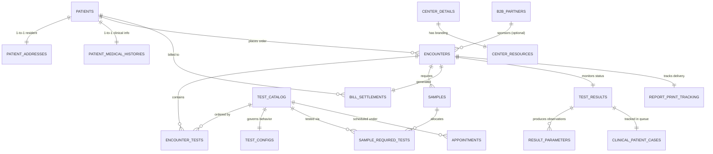

# DLabs Diagnostics LIMS - Database Schema Directory
This document details the end-to-end database structure for the DLabs Laboratory Information Management System (LIMS). 

The schema is designed for **PostgreSQL 12+** using a fully normalized relational structure. It maps directly to all front-end pages, state variables, and transactional pathways found in the codebase.

The corresponding initialization SQL script is located at [lims_database_schema.sql](file:///d:/Ottobon/dlabs-lims/lims_database_schema.sql).

---

## 1. Entity-Relationship (ER) Architecture
The diagram below illustrates the core data relationships between the patients, registration orders, physical accession samples, clinical results, and B2B configurations.



---

## 2. Page & Module Mapping to Database Tables
Here is the index of which pages write/read data to which PostgreSQL tables:

### A. Patient Registration & Billing Intake (`RegistrationModule.tsx`)
*   **Module Purpose**: Register new walk-in or corporate patients, collect clinical travel/history checklists, select diagnostic tests, check B2B discount rates, issue paid/due invoices, print barcodes, and display printer configurations.
*   **Database Tables**:
    1.  `patients`: Demographic profile, MRN, National ID.
    2.  `patient_addresses`: Location area, district, pincode, ward.
    3.  `patient_medical_histories`: CoWIN beneficiary number, travel history, symptom lists, active medical conditions (stored as text arrays).
    4.  `encounters`: The primary Order log linking patient to ordered test codes.
    5.  `encounter_tests`: Junction table listing test codes requested under this order.
    6.  `bill_settlements`: Invoice settlements, due amounts, billing source.
    7.  `report_print_tracking`: Verification logs to track if reports have been printed out and distributed.
    8.  `appointments`: Tracks calendar scheduling inputs and appointments.

### B. Specimen Accessioning & Collection Desk (`AccessionModule.tsx`)
*   **Module Purpose**: Assign unique barcodes to sample vials, receive collected specimens, record phlebotomy draw times, log sample rejections (hemolyzed, clotted, quantity insufficient) with custom reasons, and request redraws.
*   **Database Tables**:
    1.  `samples`: Tracks individual tubes (EDTA, Serum, Urine, Plasma, Swab) collected under an accession number, barcode ids, and collection stamps.
    2.  `sample_required_tests`: Junction mapping representing which ordered tests must be analyzed from this specific vial.
    3.  `clinical_patient_cases` (writes status updates): Sets status to 'Incomplete' or 'Cancelled' based on rejection codes.
    4.  `sample_vial_settings`: Standardized tube configurations and vacuum containers for accessioning.

### C. Clinical Pathology Operations Console (`OperationsModule.tsx`)
*   **Module Purpose**: Display waiting lists by status (Incomplete, Partially Completed, Reruns, emergency STATs), enter observed parameter numbers, run automated abnormal flag checks, record pathologist sign-off logs, and display Turnaround Time (TAT) analytics.
*   **Database Tables**:
    1.  `test_results`: Parent result record for an accession number.
    2.  `result_parameters`: Observational values, units, reference limits, abnormal flags.
    3.  `clinical_patient_cases`: Pathologist workspace tracking notes, turnaround warnings, and outsourced lab specialty routing.

### D. Administrator Panel Configurations (`AdminModule.tsx`)
*   **Module Purpose**: Customize test price lists, configure auto-approval/verification statuses, add B2B partner accounts, configure branch coordinates, upload headers/logos, configure invoice templates, manage LIMS users, and view API integration telemetry.
*   **Database Tables**:
    1.  `lab_profiles`: General LIMS branding singleton metadata.
    2.  `test_catalog` & `test_configs`: Master lookup lists for prices, departments, and approval workflows.
    3.  `b2b_partners`: Corporate partnerships, outstanding balances, and limits.
    4.  `price_lists`: Base directories for corporate, retail, and CGHS lists.
    5.  `center_details` & `center_resources`: Branch coordinates and header/footer PDF layouts.
    6.  `bill_settings` & `invoice_settings`: Margin heights, VAT options, and accession rules.
    7.  `system_users`: Registered lab personnel accounts and authorization roles.
    8.  `system_integrations`: Outbound webhook logs and error counts.
    9.  `financial_dashboard`: Singleton tracking daily revenue indicators.
    10. `referring_doctors`: Commission rates and clinic details for affiliated physicians.
    11. `satellite_centers`: External clinical intake networks and location configurations.

---

## 3. Database Initialization & Seeding Guide
You can spin up and initialize this database in PostgreSQL with the following steps:

### Step 1: Create Database
Run in your PostgreSQL command line tool (psql) or query editor:
```sql
CREATE DATABASE dlabs_lims;
```

### Step 2: Run the DDL Script
Execute the initialization script to generate tables, checks, indexes, and initial records:
```bash
psql -U postgres -d dlabs_lims -f dlabs_lims_schema.sql
```
*Alternatively, copy-paste the entire contents of [lims_database_schema.sql](file:///d:/Ottobon/dlabs-lims/lims_database_schema.sql) into pgAdmin, DBeaver, or VS Code SQL Runner and click Execute.*

---

## 4. Key Workflows - SQL Examples
Here are standard clinical SQL queries modeled after LIMS actions:

### Workflow A: Generating a Customer Billing Invoice
Calculates the subtotal, B2B discount percentage, final total, amount paid, and outstanding balances.
```sql
SELECT 
    e.encounter_id,
    e.accession_no,
    p.patient_name,
    p.mrn,
    COALESCE(partner.partner_name, 'Direct Walk-In') AS billing_source,
    b.bill_amount AS base_subtotal,
    COALESCE(partner.discount_percentage, 0) AS partner_discount_pct,
    b.bill_amount - b.due_amount AS amount_paid,
    b.due_amount AS balance_outstanding,
    b.status AS payment_status
FROM encounters e
JOIN patients p ON e.patient_id = p.patient_id
JOIN bill_settlements b ON e.encounter_id = b.encounter_id
LEFT JOIN b2b_partners partner ON e.partner_id = partner.partner_id
WHERE e.accession_no = 'ACC-10020';
```

### Workflow B: Phlebotomy Draw List (Outstanding collections)
Identifies which specimens are pending physical draw/collection in the floor queue.
```sql
SELECT 
    s.accession_no,
    s.sample_id,
    p.patient_name,
    p.gender,
    p.age,
    s.sample_type,
    s.status AS collection_status,
    STRING_AGG(t.test_name, ' + ') AS tests_requiring_this_vial
FROM samples s
JOIN encounters e ON s.accession_no = e.accession_no
JOIN patients p ON e.patient_id = p.patient_id
JOIN sample_required_tests srt ON s.sample_id = srt.sample_id
JOIN test_catalog t ON srt.test_code = t.test_code
WHERE s.status = 'Pending Collection'
GROUP BY s.accession_no, s.sample_id, p.patient_name, p.gender, p.age, s.sample_type, s.status;
```

### Workflow C: Clinical Operations Queue (Abnormal Findings Checklist)
Finds all clinical results where parameters are outside normal min/max bounds so pathologists can review and sign off.
```sql
SELECT 
    tr.result_id,
    e.accession_no,
    p.patient_name,
    p.mrn,
    c.category AS queue_status,
    rp.parameter_name,
    rp.observed_value,
    rp.unit,
    rp.reference_range,
    rp.min_value,
    rp.max_value,
    c.notes AS biochemist_flags
FROM test_results tr
JOIN encounters e ON tr.accession_no = e.accession_no
JOIN patients p ON e.patient_id = p.patient_id
JOIN clinical_patient_cases c ON tr.result_id = c.result_id
JOIN result_parameters rp ON tr.result_id = rp.result_id
WHERE rp.is_abnormal = TRUE
ORDER BY e.created_at DESC;
```

### Workflow D: Outsource Lab Specialty Routing Tracker
Checks which patients have ordered tests that are outsourced, including target center details.
```sql
SELECT 
    e.accession_no,
    p.patient_name,
    t.test_name,
    t.department,
    t.outsource_center,
    t.average_tat,
    s.barcode_number AS shipping_barcode
FROM encounters e
JOIN patients p ON e.patient_id = p.patient_id
JOIN encounter_tests et ON e.encounter_id = et.encounter_id
JOIN test_catalog t ON et.test_code = t.test_code
LEFT JOIN samples s ON e.accession_no = s.accession_no AND s.sample_type = 'Serum'
WHERE t.outsource_status = 'Outsourced';
```

---

## 5. Architectural Considerations for Scale
When building a production back-end using this schema, keep these practices in mind:
1.  **JSONB for High Flexibility Checklist Fields**: If symptom listings or travel checklists change dynamically, consider using PostgreSQL `JSONB` columns instead of `TEXT[]` to store structured nested arrays.
2.  **Audit Logs & History Tables**: In a clinical environment, any modifications to observed result values must record the user ID, timestamp, and previous value in an audit ledger table for compliance.
3.  **Encrypted Report Sharing Keys**: Sharing keys or barcode credentials must use proper cryptographic hashing to maintain HIPAA patient confidentiality.
